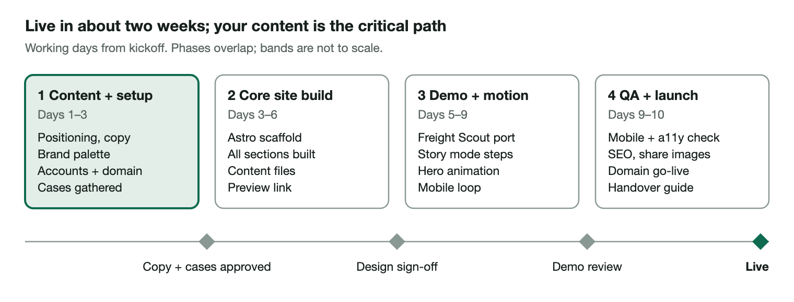

# PRD — Supply Chain AI Consulting Website

Version 1.0 · 6 October 2026 · Owner: Sherif Yehia

## 1. Overview and goals

A single-page-first marketing site that turns a supply chain leader's visit into a booked discovery call within 2 minutes of reading. It positions a solo-founder practice as senior, hands-on and AI-native, and proves it with real cases and a live, animated demo.

**Primary audience:** VP / Director of Supply Chain, Operations, Logistics or Procurement at mid-market companies ($50M–$2B revenue). Secondary: COOs, PE operating partners, and peers who refer work.

**Goals**

1. Explain in one screen what we offer and who it is for.
2. Build trust through 3–4 visual case studies with quantified outcomes.
3. Show capability, not claims, through an interactive demo with motion.
4. Convert: a clear "Book a call" path on every section.
5. Be updatable by the founder in minutes without a developer.

**Success metrics (first 90 days after launch)**

| Metric | Target |
| --- | --- |
| Visitor → booked call | ≥ 2% |
| Demo section engagement (scrolled into view + interaction) | ≥ 40% of visits |
| Lighthouse performance / accessibility | ≥ 90 / ≥ 95 |
| Time to publish a new case study | < 15 minutes |

## 2. Site map and page requirements

One long scrolling home page carries the story; cases and the demo also get their own pages so they can be shared by link. Six pages total at launch.

| Section / page | Purpose | Must have |
| --- | --- | --- |
| **Hero (home)** | Say who we help and the result, in 8 seconds | Headline + one-line subhead, primary CTA "Book a 30-min call", secondary CTA "See the demo", subtle animated supply-network background |
| **What we offer** | Make the services concrete | 3 offer cards (e.g. AI Readiness Sprint, Pilot Build, Fractional AI Lead), each with who it's for, duration, deliverables |
| **Approach** | Show a low-risk, repeatable method | 4-step process (Diagnose → Design → Pilot → Scale), animated step by step on scroll, time-box per step |
| **Cases** (home teaser + case pages) | Prove outcomes | 3–4 cards with one hero metric each (e.g. "−18% expedite cost"); detail page: problem, approach, solution visual, results, quote. Anonymised client names allowed |
| **Demo** (home teaser + demo page) | Show capability live | Embedded interactive demo with motion (section 3), plus a 60-second autoplay preview for mobile |
| **About** | Build trust in the founder | Photo, short story, supply chain + AI credentials, logos of past employers/clients (with permission), LinkedIn link |
| **Contact / CTA** | Convert | Cal.com or Calendly embed + simple form (name, email, company, challenge). CTA repeated on every page |
| **Footer** | Hygiene | Email, LinkedIn, privacy notice, copyright |

**Global:** sticky header with section links and the CTA button; mobile-first layout; dark theme optional (v2).

## 3. Demo and motion UX

The demo reuses **Freight Scout** from the Freight Agent project: its matching, scoring and pricing engine is already pure TypeScript on seeded mock data, so it runs in the browser with no backend. We wrap it in a guided, animated "story mode" built for a website visitor, not a planner.

**Demo requirements**

1. **Guided story mode (default):** 4–5 scripted steps, e.g. "A truck goes empty in Toronto" → board scan animates loads appearing on a map → constraints filter them out with a fade → top 5 ranked with animated score bars → recommended rate band slides in.
2. **Try-it mode:** visitor picks a truck/lane from 3 presets and sees live results from the real engine.
3. **Plain-English explanations** beside each step ("Why this load scored 87").
4. **Mobile:** a lightweight autoplay loop (Lottie or MP4 under 1.5 MB) instead of the full app.
5. **Isolation:** the demo loads only when scrolled into view, so it never slows the homepage.
6. **Pluggable:** a `demos/` folder so a second demo (e.g. inventory forecasting) can be added later without touching the rest of the site.

**Motion across the site**

- Hero: slow animated supply network (nodes and flowing lanes), SVG + CSS, under 50 KB.
- Sections: fade/slide-in on scroll; Approach steps draw a connecting line as you scroll.
- Case cards: metric counters count up when visible; hover lifts the card.
- Library: **Motion (Framer Motion)** for React components; CSS for simple effects.
- All motion respects the visitor's reduced-motion setting and stays under 400 ms per transition.

## 4. Content model and maintenance

All words and numbers live in plain Markdown/JSON files, separate from code, so updating the site means editing a text file and pushing (or asking Claude to). No database, no CMS login to manage.

| Content | Where it lives | How you update it |
| --- | --- | --- |
| Hero, offer, approach, about text | `content/site.md` (one file, labelled sections) | Edit text, save, push — live in about 1 minute |
| Case studies | `content/cases/<name>.md` — one file each: title, industry, hero metric, problem, approach, results, image | Copy an existing case file, change the fields |
| Offers | `content/offers.json` | Add or edit an entry |
| Images / logos | `public/images/` | Drop the file in, reference it by name |
| Demo | `src/demos/freight-scout/` | Code change (ask Claude) |

**Maintenance principles**

- Every change goes through GitHub: full history and one-click rollback.
- Every push creates a preview link before going live.
- Typed content schemas: a missing field (e.g. a case without a metric) fails the build instead of breaking the page.
- Optional later: a browser-based editor (Decap CMS or TinaCMS) on top of the same files.

## 5. Tech stack and non-functional requirements

Recommended: **Astro + React islands + Tailwind, hosted on Vercel or Netlify**. Astro ships plain HTML for text pages (fast, good SEO) and loads React only for the demo, which lets us reuse Freight Scout's React/TypeScript code almost as-is.

| Layer | Choice | Why |
| --- | --- | --- |
| Framework | Astro 5 | Content collections for Markdown cases; near-zero JavaScript by default |
| Interactive parts | React 18 + Motion | Same stack as Freight Scout; mature animation library |
| Styling | Tailwind CSS + a design-token file | Change brand colours/fonts in one place |
| Hosting | Vercel or Netlify (free tier) | Auto-deploy on push, preview links, HTTPS, CDN |
| Domain | Your registrar (Namecheap, Cloudflare) | About $12–20 per year |
| Booking | Cal.com or Calendly | Free tier is enough |
| Forms | Netlify Forms or Formspree | No backend to run |
| Analytics | Plausible or Vercel Analytics | Privacy-friendly, no cookie banner needed |

**Running cost:** about $0–20 per month plus the domain.

**Non-functional requirements**

- Performance: Lighthouse ≥ 90 on mobile; homepage under 200 KB before the demo loads.
- Accessibility: WCAG 2.1 AA, keyboard navigable, reduced-motion support.
- SEO: per-page titles and descriptions, LinkedIn share images, sitemap, schema.org ProfessionalService markup.
- Responsive from 360 px phones to wide desktop.
- Privacy: no tracking cookies; simple privacy page.

## 6. What is needed from you

Claude writes all code, drafts all copy, builds the animations, adapts Freight Scout into the demo, and sets up deployment. You supply the decisions, the facts only you have, and the accounts that must be in your name.

**Content and decisions**

- [ ] Practice name and a one-line positioning statement (Claude drafts 3 options)
- [ ] The 2–4 offers to sell, with rough scope and duration; show pricing or not
- [ ] 3–4 case studies: problem, what you did, measurable result; named or anonymised
- [ ] Founder bio, high-res headshot, LinkedIn URL, logos you have permission to show
- [ ] Brand preferences: colours, fonts, 2–3 websites you like (or Claude proposes a palette)
- [ ] Confirm Freight Scout can be shown publicly (all its data is fictional)

**Accounts in your name (guided, about 10 minutes each)**

- [ ] Domain name purchased
- [ ] GitHub account (holds code and content)
- [ ] Vercel or Netlify account connected to GitHub
- [ ] Cal.com or Calendly booking link
- [ ] Business email on the domain (Google Workspace or similar)

**What Claude cannot do for you:** buy the domain, create accounts, enter payment details, or change DNS at your registrar. You get exact steps; you click.

## 7. Timeline and milestones

About 2 weeks (10 working days) from kickoff to live, if content and accounts are ready by day 3. Claude's hands-on build time is roughly 4–5 focused sessions; most elapsed time is your reviews and content.

| Phase | Days | Work | Gate at end |
| --- | --- | --- | --- |
| 1 Content + setup | 1–3 | Positioning and copy, brand palette, accounts and domain, cases gathered | Copy + cases approved |
| 2 Core site build | 3–6 | Astro scaffold, all sections built, content files, preview link | Design sign-off |
| 3 Demo + motion | 5–9 | Freight Scout port, story mode, hero animation, mobile loop | Demo review |
| 4 QA + launch | 9–10 | Mobile and accessibility checks, SEO and share images, domain go-live, handover guide | Live |

A slip in phase 1 (cases, bio, approvals) moves every later date by the same amount.

| Who | Effort |
| --- | --- |
| You | About 6–8 hours total: content answers, 4 reviews, account setup |
| Claude | Code, copy drafts, demo port, animation, deployment, handover guide |
| Ongoing upkeep | 10–15 minutes per new case or text change; no recurring developer cost |

## 8. Open questions and out of scope

**Open questions**

- [ ] "We" or "I" voice? Solo founders often convert better with "I" plus a named partner network.
- [ ] Show pricing or "from" ranges on offers, or keep it to a call?
- [ ] Which 3–4 cases are strongest, and can any client be named?
- [ ] Is Freight Scout the only demo at launch, or should story mode also preview a second use case (inventory or demand forecasting)?
- [ ] English only, or a second language at launch?

**Out of scope for v1 (easy to add later)**

- Blog / insights section (add when there are 3+ posts)
- Newsletter signup, gated downloads, client login
- Live AI chat on the site (the demo uses scripted steps + engine logic, no paid API calls)
- Multi-language
